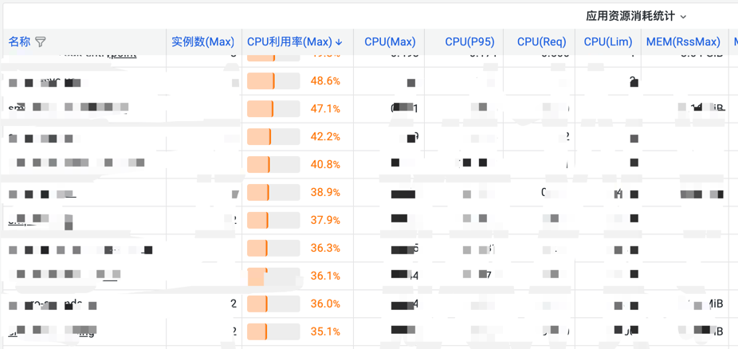

# inspect
Inspect 巡查工具用于服务的容量评估，帮助用户合理调整自己的服务配置

## 背景
我们知道监控有四个黄金指标
* 延迟
* 流量
* 错误率
* 饱和度

其中前三个黄金指标是大家容易通过监控数据能够查出来的。但是饱和度是很难有个直观的数据去查看的，需要聚合多种数据然后来查询。

例如
* 应用基础监控
  * CPU 利用率： CPU Usaqe / Cpu Limit 
  * Memory 利用率: Memory Usaqe / Cpu Limit
  * Disk 利用率: Disk Usaqe / Disk Limit
* 业务监控
  * 队列 饱和度： 队列长度 / 队列消费能力 * pod数
  * 耗时 饱和度： max耗时 / 耗时预设值

根据以上指标，我们通过`Inspect`程序，每天定时跑前一天数据，汇总得到以下图表。



## 部分Grafana的SQL写法
### Cpu 利用率
```sql
SELECT 
  a.time AS "time", a.target_name,max(a.val) / max(b.val) as "CPURateMAX"
FROM
	report_measure a LEFT JOIN report_measure b ON a.target_name = b.target_name
WHERE
	a.metric = 'CpuUsage' AND b.metric = 'CpuLimit'
	AND $__unixEpochFilter(a.time)
	AND $__unixEpochFilter(b.time)
GROUP BY
	a.target_name
```
### 最大CPU
```sql
SELECT
  time AS "time",max(val) AS "AppPodCPU", target_name
FROM report_measure
WHERE
  $__unixEpochFilter(time) AND metric = 'CpuUsage'
GROUP BY target_name
```

### 内存利用率
```sql
SELECT 
  a.time AS "time",a.target_name,max(a.val) / max(b.val) as "MemRateMAX"
FROM
	report_measure a LEFT JOIN report_measure b ON a.target_name = b.target_name
WHERE
	a.metric = 'AppPodMem'	AND b.metric = 'MemLim'
    AND $__unixEpochFilter(a.time)
	AND $__unixEpochFilter(b.time)
GROUP BY
	a.target_name
```

## 如何运行程序
* 创建数据库：inspect
* 在 config.yaml 的 mysql.dsn 中填好数据库地址，账号，密码
* 安装数据库：./inspect --config=config/config.yaml --job=install
* 执行程序: ./inspect --config=config/config.yaml

## 如何观测数据
* 导入 docs/grafana.json
* 直接查看数据